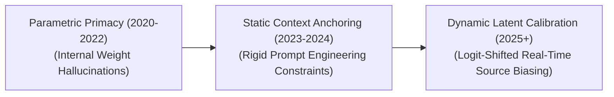

# Awesome-Retrieval-Biased-Generation
## Retrieval-Biased Generation (RBG): Evolution, Variants, Types, & Applications

Retrieval-Biased Generation (RBG)—often discussed in context with knowledge primacy, source anchoring, and contextual bias in Large Language Models—is an advanced architectural and behavioral paradigm mapping out how generative models reconcile historical internal memory with newly retrieved context. In any Retrieval-Augmented Generation (RAG) system, an implicit tension exists between the model's parametric knowledge (facts frozen during pre-training) and its non-parametric knowledge (facts injected on-the-fly from an external vector store). Retrieval-Biased Generation covers the methods, calibrations, and training mechanics that intentionally bias the output text distribution toward fetched document sources. By systematically tuning a model to trust dynamic contexts over pre-existing weight parameters, RBG eliminates outdated data footprints, guarantees strict corporate compliance, and forces real-time factual alignment.

---

## 1. The Chronological Evolution

The technical framework governing how models handle retrieved constraints has transitioned from naive textual appending to attention-weighted balancing and dynamic inference-time token redirection.

*   **The Parametric Primacy Era (Pre-2023)**
    *   *Concept:* The early foundation era. Models were heavily biased toward their own internalized weights. Even when relevant external data was injected via early RAG prompts, the model would routinely bypass the context and hallucinate or double-down on stale, outdated facts learned during its multi-month pre-training cycle.
*   **The Rigid Prompt-Engineering Era (~2023–2024)**
    *   *Concept:* Attempted to force retrieval bias through surface-level natural language instructions. Systems used explicit system prompts (e.g., `"Answer the query strictly using the provided context. If the answer is not in the text, say 'I do not know'. Do not use your own knowledge."`).
    *   *Limitation:* Highly fragile. Under intense context lengths, models frequently fell victim to the **"Lost in the Middle"** phenomenon, dropping attention over long document fragments and defaulting back to parametric weights.
*   **The Dynamic Latent & Logit Calibration Era (~2025–Present)**
    *   *Concept:* The modern state-of-the-art framework. Moves away from weak verbal coercion toward absolute mathematical routing. Modern engines run dual-pass tracking or evaluate **Source-Attribution Tokens** natively. By computing separate attention vectors over the retrieved tokens versus prompt tokens, the runtime engine applies an explicit **Logit Bias Modifier** to force the generation token path to align strictly with the factual geometry of the vector database.

---

## 2. Core Functional & Bias-Direction Variants

Retrieval-Biased Generation configurations are categorized based on the architectural mechanism deployed to tilt the final probability distribution toward retrieved source text.

-	### A. Strict External-Anchored Bias (Zero-Parametric Override)
	*   **Mechanism:** Enforces absolute dominance of the retrieved context. The generation layer calculates token choices strictly as a conditional function of the fetched document embeddings. If an un-aligned token begins to peak in probability due to base weight distributions, its logit value is suppressed to zero.
	*   **Application:** Crucial for legal contract analysis and clinical drug dosage lookups, where a single out-of-context parametric assumption creates critical liability risks.

-	### B. Adaptive Dual-Pass Alignment (Balanced RBG)
	*   **Mechanism:** Computes two separate probability vectors concurrently: one pass over the prompt using standard weights, and a second pass over the prompt interleaved with the retrieved chunks. The system measures the divergence between both layers, applying an adjustable **Retrieval Bias Parameter ($\beta$)** to smoothly balance creative expression with hard-vetted fact retrieval.

-	### C. Source-Attributed Token Routing
	*   **Mechanism:** The model undergoes targeted Supervised Fine-Tuning (SFT) to dynamically track the parent document coordinates of every generated fact. The self-attention heads explicitly map query tokens to specific document chunk indices, generating markdown text interwoven with absolute source verification keys.

---

## 3. Structural Integration & Context Horizon Types

Depending on how the text distribution is influenced across deep neural network layers, retrieval biasing is engineered across distinct structural checkpoints.

*   **Pre-Inference Query Rewriting**
    *   *Profile:* Modifies data before the primary generation loop. An auxiliary parser reads the user's intent, converts it into a highly structured, keyword-dense query array, and pulls data. It then reformats the entire prompt structure to frame the retrieved text as an absolute truth matrix, minimizing downstream parameter friction.
*   **In-Context Attention Rescaling**
    *   *Profile:* Operates within the self-attention blocks of the Transformer. The mask is calibrated to dynamically amplify the attention weights assigned to the position embeddings of the retrieved document chunks, forcing deep layers to continuously read and prioritize the fetched data tokens over historical conversation memory.
*   **Post-Hoc Verification Reranking**
    *   *Profile:* The language model generates $N$ alternative candidate answers simultaneously. A secondary, highly specialized value network or a cross-encoder evaluates all $N$ options, filtering out any response that displays parametric drift, and selecting the candidate that is most strictly biased toward the reference text.

---

## 4. Production Engineering Challenges & Hardware Solutions

Enforcing severe context bias across high-volume commercial pipelines changes the compute profile and introduces unique capability boundaries.

*   **The Context Window Saturation & Latency Penalty**
    *   *The Problem:* Forcing a model to continuously biases its generations toward thousands of lines of external documentation inflates the active Key-Value (KV) cache, saturating GPU VRAM and introducing processing latencies that compromise real-time interactive streaming.
    *   *Mitigation:* Implementing **PagedAttention virtual memory structures** to eliminate memory fragmentation, coupled with **Grouped-Query Attention (GQA)** to compress the dimensional scale of the cached attention matrices.
*   **The Sycophancy and Data Contamination Risk**
    *   *The Problem:* If a model is tuned to blindly trust retrieved context over everything else, it becomes highly vulnerable to **Sycophancy** or **Adversarial Context Contamination**. If a vector database is poisoned with an inaccurate or malicious document (e.g., claiming `"The sky is bright green"`), the retrieval-biased model will instantly override its own common sense and generate a false output.
    *   *Mitigation:* Layering a lightweight, rule-based **Factual Guardrail Filter** right before the generation phase, checking retrieved claims against strict semantic boundaries before allowing the logit bias modifier to execute.

---

## 5. Frontier Real-World AI Applications

*   **Automated Regulatory Corporate Compliance & Auditing Systems**
    *   *Application:* Scans continuous corporate portfolios against volatile, updated global tax and legal codes. Retrieval-Biased Generation ensures that the auditing model frames compliance rulings strictly around current regional tax mandates fetched from live local databases, suppressing outdated historical criteria completely.
*   **Real-Time Financial Market & Portfolio Synthesis Engines**
    *   *Application:* Generates real-time equity risk summaries for investment banks. The model's token path is biased strictly toward moving high-frequency stock tickers and SEC filing forms fetched from live streaming databases mid-sentence, preventing outdated pre-training memory from skewing risk predictions.
*   **Clinical Medical Diagnostic Decision Support Assistants**
    *   *Application:* Cross-references patient electronic health records (EHR) with massive biomedical literature repositories. The RBG configuration forces the model to synthesize proposed treatment paths based purely on current peer-reviewed oncology or pharmacology whitepapers, ensuring safer diagnostic guidance by overriding general parametric weights.

---

## References
1. Lewis, P., et al. (2020). Retrieval-augmented generation for knowledge-intensive NLP tasks. *Advances in Neural Information Processing Systems (NeurIPS)*, 33, 9459-9474.
2. Liu, N. F., et al. (2023). Lost in the middle: How language models use long contexts. *arXiv preprint arXiv:2307.03172*.
3. Shi, F., et al. (2023). REPLUG: Retrieval-augmented black-box language models. *arXiv preprint arXiv:2301.12652*.
4. Shuster, K., et al. (2021). Retrieval augmentation reduces hallucination in conversation. *arXiv preprint arXiv:2104.07567*.
5. Asai, A., et al. (2023). Self-RAG: Learning to retrieve, generate, and critique through self-reflection. *arXiv preprint arXiv:2310.11511*.
6. Gao, L., et al. (2024). Active retrieval augmented generation. *International Conference on Learning Representations (ICLR)*.

---

To advance this documentation repository, structural stack, or framework setup, consider pursuing these adjacent research vectors:
* Build a **Python script utilizing the Transformers library** demonstrating how to calculate and apply a custom logit bias modifier to force a model to select tokens present within a retrieved text tensor.
* Generate a **comprehensive Markdown table** explicitly analyzing Parametric Generation, Static RAG, Retrieval-Interleaved Generation (RIG), and Retrieval-Biased Generation (RBG) across runtime latency, vulnerability to memory hallucinations, indexing costs, and context budget efficiency.
* Establish an **automated evaluation benchmark** to track how shifting the retrieval bias parameter ($\beta$) influences the model's performance on long-context factual retrieval tasks under intentional adversarial prompt injections.

***

**Related Topics**: To maximize your systemic overview of data integration architectures, explore these related documentation sets:
* To see how models parse incoming text documents into dense visual grids, read **[Vision Transformers (ViTs) in AI](https://github.com)**.
* To master the real-time interleaving techniques that feed biased generation streams, see **[Retrieval-Interleaved Generation (RIG)](https://github.com)**.
* To trace the foundational baseline history of document ingestion pipelines, explore **[Retrieval-Augmented Generation (RAG) Architectures](https://github.com)**.
Bad response
