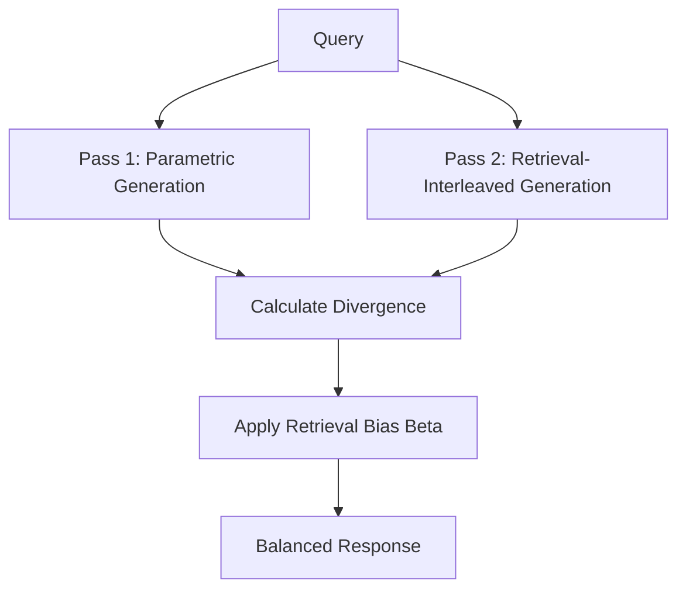

# Adaptive Dual-Pass Alignment (Balanced RBG)

Adaptive Dual-Pass Alignment computes two probability distributions simultaneously: one based on standard model weights, and another interleaved with retrieved text. A dynamic bias parameter beta balances creative and factual fidelity.

## Architecture & Data Flow

---

[Back to README](../README.md)
