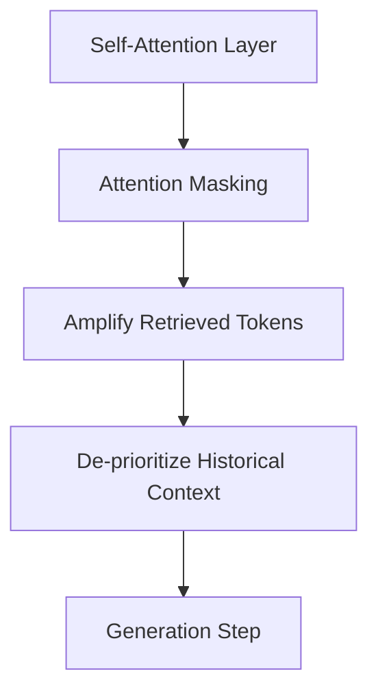

# In-Context Attention Rescaling

Operates inside the Transformer architecture by adjusting attention masking weights to prioritize retrieved document embeddings over general contextual history.

## Architecture & Data Flow

---

[Back to README](../README.md)
