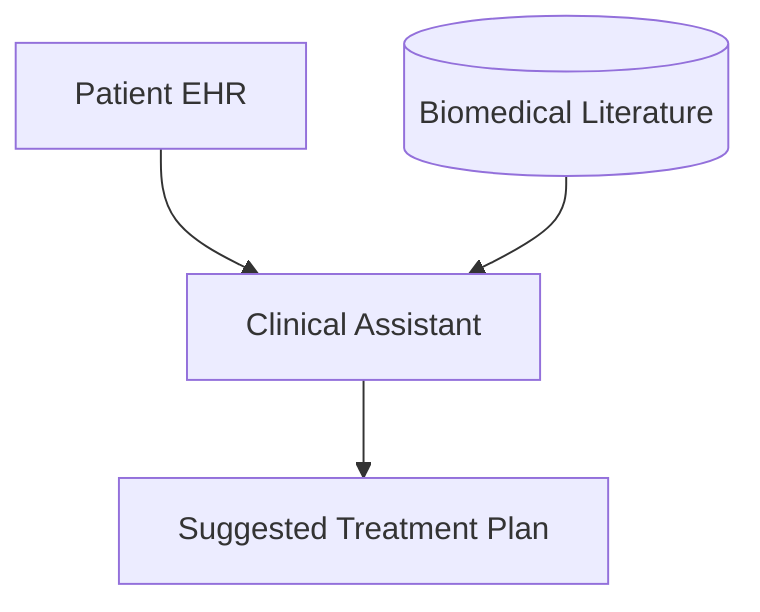

# Clinical Medical Diagnostic Decision Support Assistants

Medical assistants cross-reference patient histories with oncology/pharmacology papers, ensuring suggestions conform exactly to active peer-reviewed research.

## Architecture & Data Flow

---

[Back to README](../README.md)
