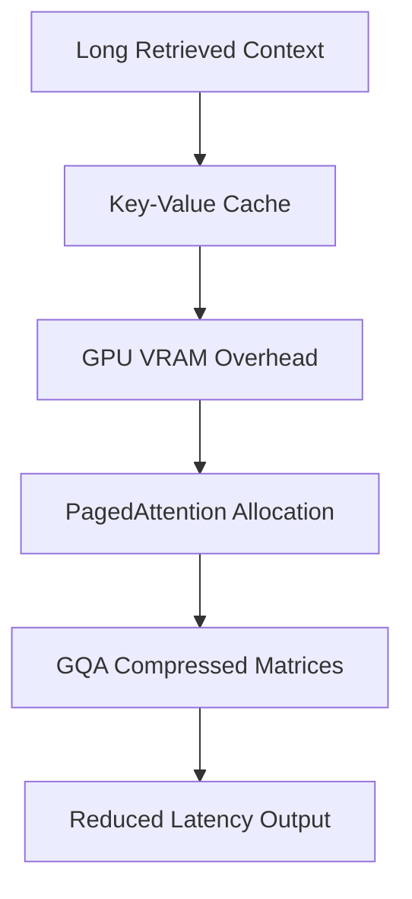

# Context Window Saturation & Latency Penalty

Large KV-caches saturate VRAM. We mitigate this using PagedAttention virtual memory structures and Grouped-Query Attention (GQA) to keep production systems fast.

## Architecture & Data Flow

---

[Back to README](../README.md)
