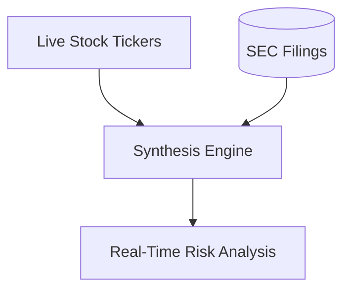

# Real-Time Financial Market & Portfolio Synthesis Engines

Real-time market tracking demands immediate factual alignment. Financial synthesis engines bias generations toward fresh ticker streams and filings, avoiding hallucinated trends.

## Architecture & Data Flow

---

[Back to README](../README.md)
