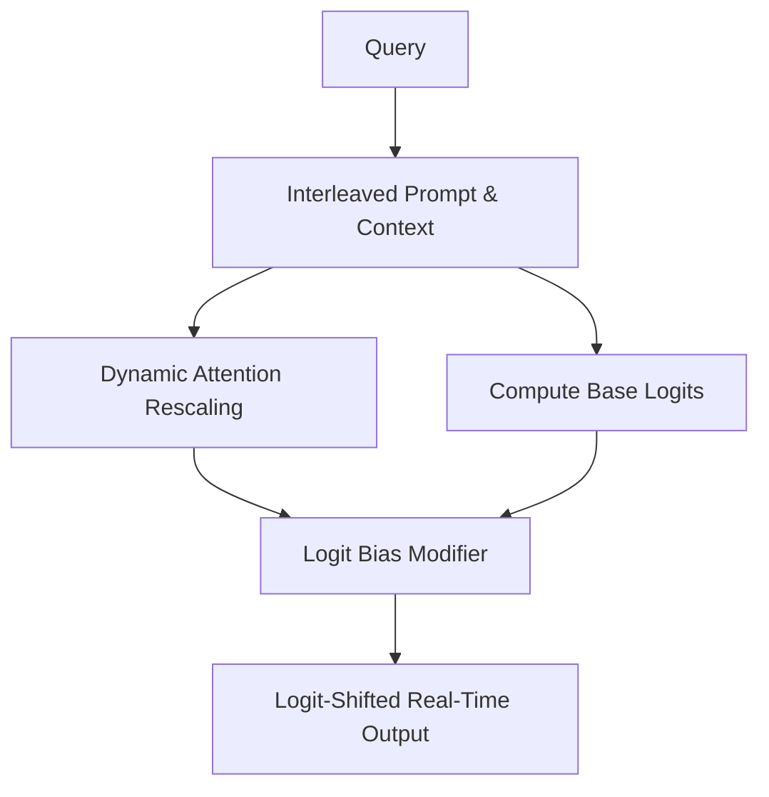

# The Dynamic Latent & Logit Calibration Era (~2025–Present)

This modern state-of-the-art approach replaces textual coercion with mathematical alignment. By modifying self-attention matrices or applying dynamic logit bias modifiers at the generation layer, it forces the LLM to output tokens aligned with the retrieved database geometry.

## Architecture & Data Flow

---

[Back to README](../README.md)
