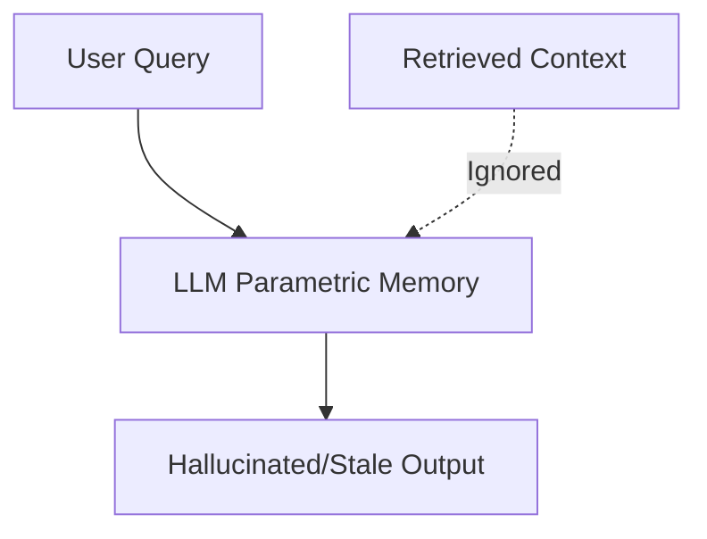

# The Parametric Primacy Era (Pre-2023)

In the Parametric Primacy Era, Large Language Models relied almost exclusively on their internalized parameters (weights) acquired during pre-training. Even when external facts were supplied in the prompt context, the self-attention mechanism tended to ignore or override this context in favor of strong parametric priors, leading to hallucinations or outdated responses.

## Architecture & Data Flow

---

[Back to README](../README.md)
