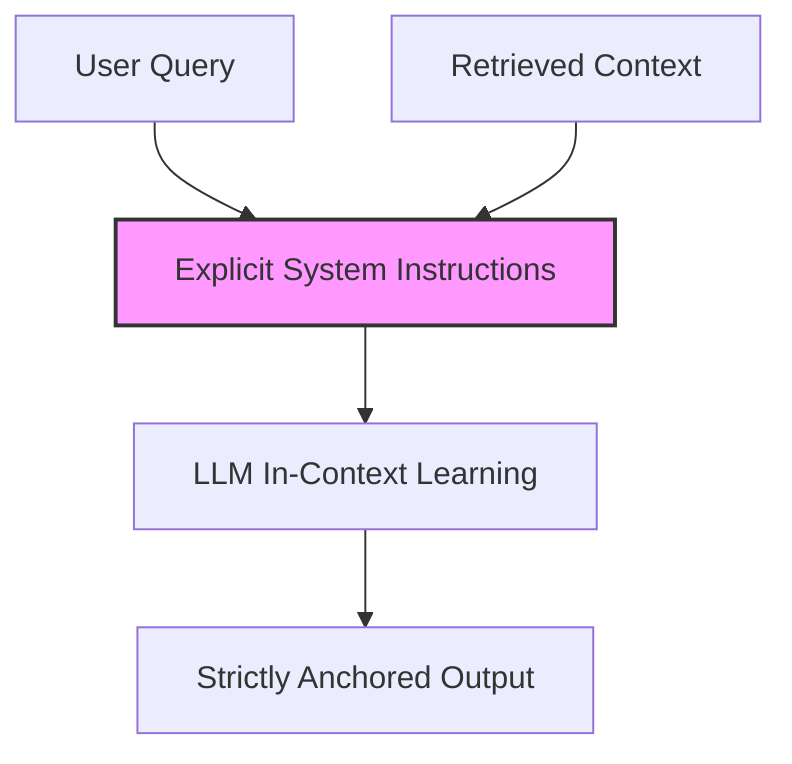

# The Rigid Prompt-Engineering Era (~2023–2024)

During this era, engineers attempted to force models to adhere to external context using natural language constraints (e.g., 'Answer strictly using the provided context...'). While simple to implement, it was fragile, especially with long contexts where models suffered from the 'Lost in the Middle' phenomenon.

## Architecture & Data Flow

---

[Back to README](../README.md)
