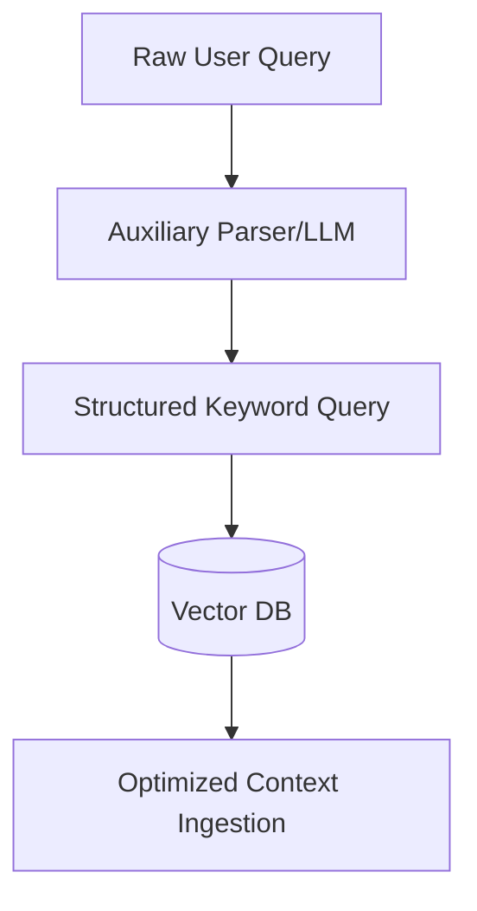

# Pre-Inference Query Rewriting

Pre-Inference Query Rewriting transforms unstructured user inputs into optimal search queries, aligning query intent with document storage schemes before the primary generation loop.

## Architecture & Data Flow

---

[Back to README](../README.md)
