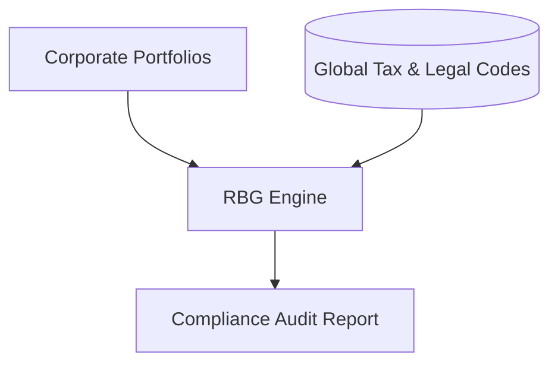

# Automated Regulatory Corporate Compliance & Auditing Systems

Applies RAG to corporate auditing by suppressing outdated historical rules and evaluating compliance strictly against the newest retrieved legal database updates.

## Architecture & Data Flow

---

[Back to README](../README.md)
