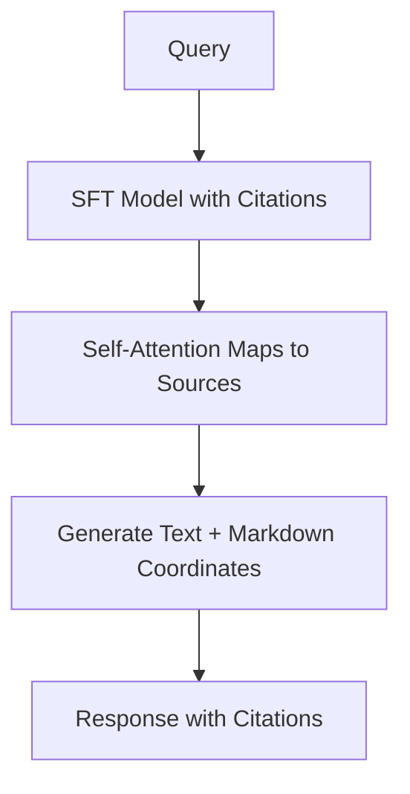

# Source-Attributed Token Routing

Through Supervised Fine-Tuning, self-attention heads are trained to map generated claims back to specific document coordinates, naturally outputting verification keys during generation.

## Architecture & Data Flow

---

[Back to README](../README.md)
