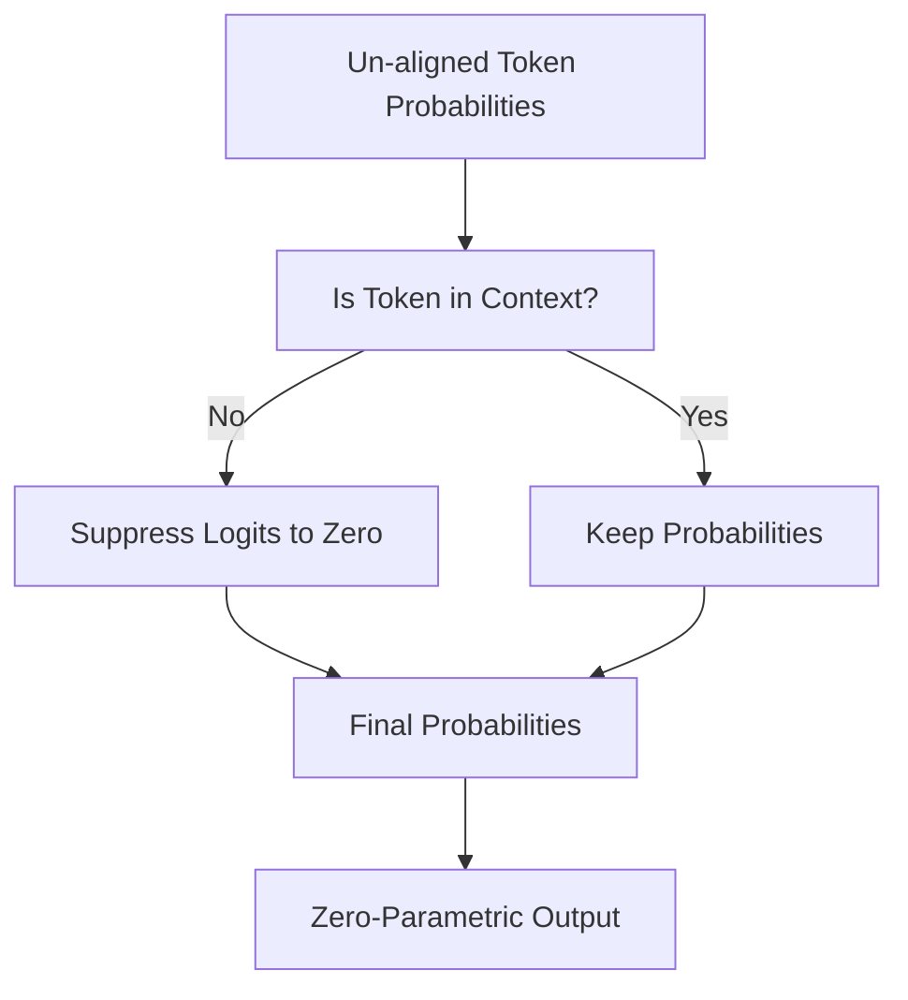

# Strict External-Anchored Bias (Zero-Parametric Override)

This configuration enforces absolute compliance by suppressing any generated token that diverges from the retrieved source context. If a parametric hallucination starts to emerge, its logit value is suppressed to zero.

## Architecture & Data Flow

---

[Back to README](../README.md)
