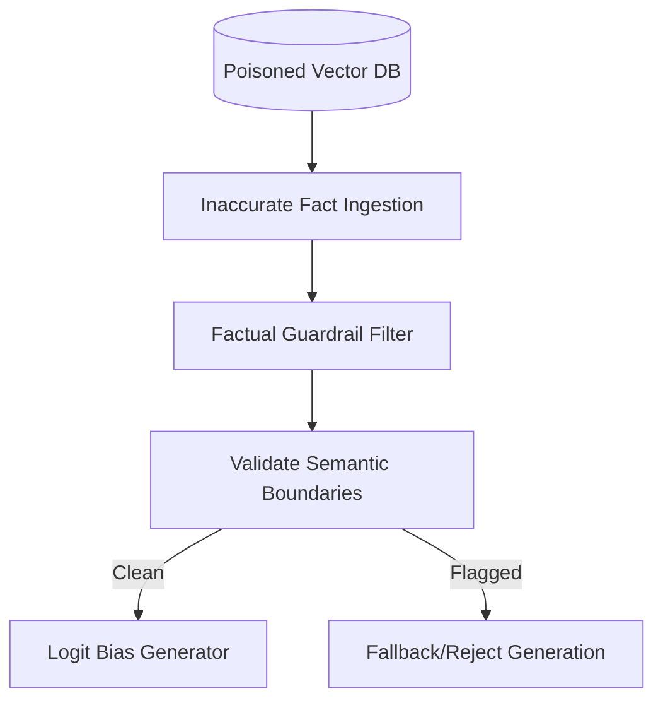

# Sycophancy and Data Contamination Risk

When a model is forced to trust retrieved documents, it risks repeating false information (sycophancy or adversarial attacks). Rule-based semantic filters inspect content before generation.

## Architecture & Data Flow

---

[Back to README](../README.md)
