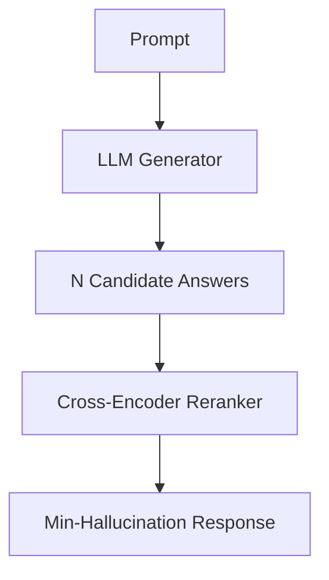

# Post-Hoc Verification Reranking

After the generator produces several candidate answers, a specialized value network or cross-encoder evaluates and ranks them to select the option most grounded in the retrieved sources.

## Architecture & Data Flow

---

[Back to README](../README.md)
